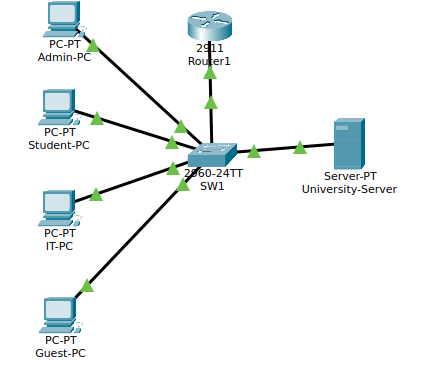
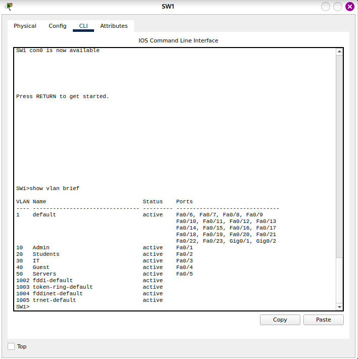
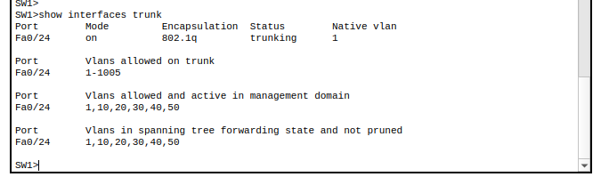
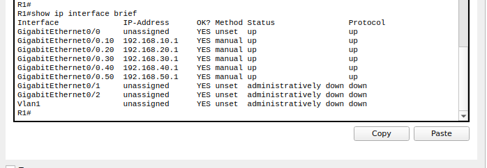
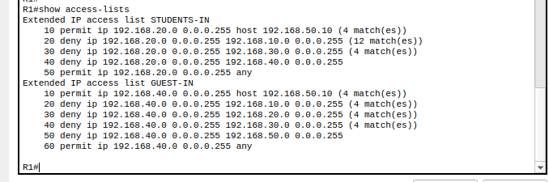
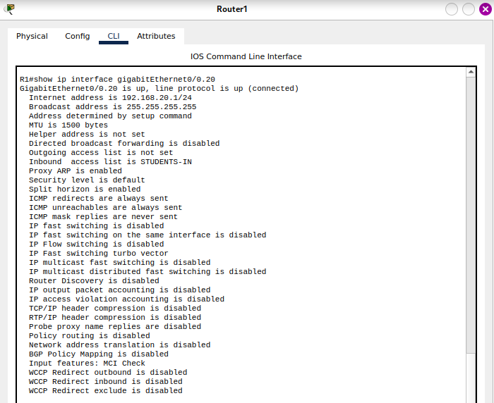
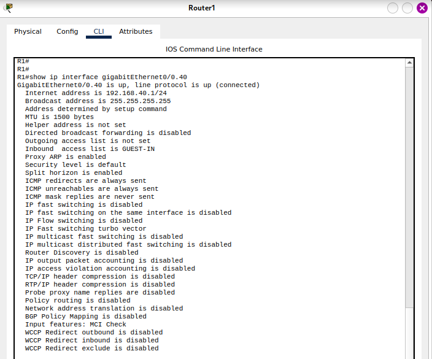
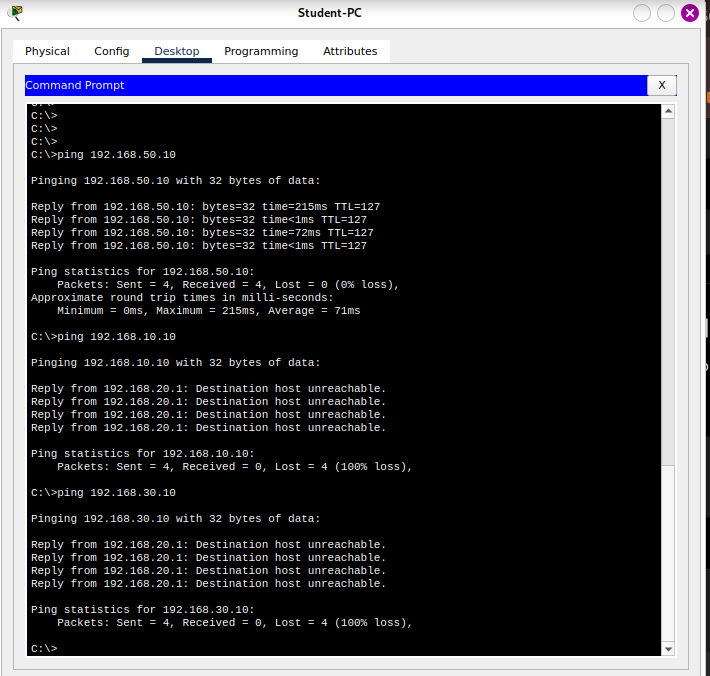
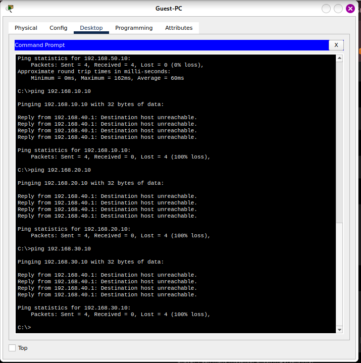

# Secure University Network with Mini SOC Lab

## Project Overview
This project demonstrates the design and security configuration of a segmented university network using Cisco Packet Tracer. The lab simulates a small university environment with multiple departments, isolated VLANs, router-on-a-stick inter-VLAN routing, and ACL-based access control rules.

The purpose of this project is to apply networking and cybersecurity fundamentals in a practical lab that can be presented in a CV, GitHub portfolio, or internship interview.

## Tools Used
- Cisco Packet Tracer
- Cisco IOS CLI
- VLANs
- Trunking
- Router-on-a-stick inter-VLAN routing
- Extended Access Control Lists (ACLs)

## Network Topology
The network includes the following devices:

| Device | Role |
|---|---|
| R1 / Router1 | Inter-VLAN routing and ACL enforcement |
| SW1 | Layer 2 switch for VLAN segmentation |
| Admin-PC | Administration department endpoint |
| Student-PC | Student network endpoint |
| IT-PC | IT department endpoint |
| Guest-PC | Guest network endpoint |
| University-Server | Shared university server |



## VLAN Design

| VLAN | Name | Subnet | Gateway | Switch Port |
|---:|---|---|---|---|
| 10 | Admin | 192.168.10.0/24 | 192.168.10.1 | Fa0/1 |
| 20 | Students | 192.168.20.0/24 | 192.168.20.1 | Fa0/2 |
| 30 | IT | 192.168.30.0/24 | 192.168.30.1 | Fa0/3 |
| 40 | Guest | 192.168.40.0/24 | 192.168.40.1 | Fa0/4 |
| 50 | Servers | 192.168.50.0/24 | 192.168.50.1 | Fa0/5 |

## Security Policy

The network security policy was implemented using extended ACLs on the router sub-interfaces.

| Source Network | Allowed Access | Blocked Access |
|---|---|---|
| Admin | Full internal access | None in this lab |
| IT | Full internal access | None in this lab |
| Students | University server only | Admin, IT, and Guest networks |
| Guest | University server only | Admin, Students, IT, and other server-network hosts |

## ACL Implementation

Two extended ACLs were created:

- `STUDENTS-IN`
- `GUEST-IN`

The ACLs were applied inbound on the relevant router sub-interfaces:

```bash
interface GigabitEthernet0/0.20
 ip access-group STUDENTS-IN in

interface GigabitEthernet0/0.40
 ip access-group GUEST-IN in
```

## Verification Results

| Test | Expected Result | Actual Result | Status |
|---|---|---|---|
| VLAN configuration | Ports assigned to correct VLANs | Correct VLAN assignments shown | Passed |
| Trunk configuration | Fa0/24 trunking | Fa0/24 trunking with VLANs 10,20,30,40,50 | Passed |
| Router sub-interfaces | All gateways up/up | All VLAN gateways up/up | Passed |
| Student to Server | Allowed | Successful ping | Passed |
| Student to Admin | Blocked | Destination host unreachable | Passed |
| Student to IT | Blocked | Destination host unreachable | Passed |
| Guest to Server | Allowed | Successful ping | Passed |
| Guest to Admin/Students/IT | Blocked | Destination host unreachable | Passed |

## Key Screenshots

### VLAN Configuration


### Trunk Verification


### Router Sub-Interfaces


### ACL Rules


### Students ACL Verification


### Guest ACL Verification


### Student Access Test


### Guest Access Test


## What I Learned
- How to design a segmented network using VLANs.
- How to configure trunking between a switch and a router.
- How to implement router-on-a-stick inter-VLAN routing.
- How to write and apply extended ACLs.
- How to test security policies using ping results.
- How to document a cybersecurity/networking lab for a technical portfolio.

## CV Description

**Secure University Network with Mini SOC Lab — Cisco Packet Tracer**
- Designed a segmented university network using VLANs, trunking, router-on-a-stick inter-VLAN routing, and ACL-based access control.
- Implemented security rules to isolate Students and Guest networks from sensitive internal networks while allowing controlled access to the university server.
- Verified the configuration through CLI commands and documented allowed/blocked traffic using testing evidence.
