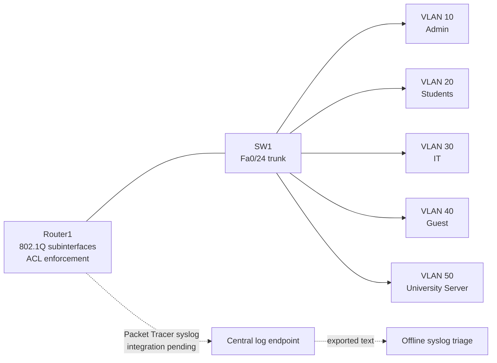

<p align="center">
  
</p>

# Secure University Network & Mini SOC Lab

**A lab-scale Cisco Packet Tracer campus network demonstrating VLAN segmentation, router-on-a-stick policy enforcement, evidence-backed traffic tests, and offline Cisco syslog triage.**

[](https://github.com/sarahalqaisi/secure-university-network-soc-lab/actions/workflows/validate.yml)
[](https://www.netacad.com/cisco-packet-tracer)
[](https://www.python.org/)
[](LICENSE)


## Why this matters

Campus networks must separate users with different trust levels and make policy outcomes observable. This project pairs an actual Packet Tracer topology with CLI screenshots, an evidence-derived static baseline, reproducible access-control scenarios, and a small offline log-triage tool. It is an educational simulation—not a production university deployment, full SIEM, or claim of comprehensive attack detection.

### Verified proof points

- Five non-overlapping `/24` zones (Admin, Students, IT, Guest, Servers) with evidenced switch membership and up/up router subinterfaces.
- Two ordered inbound extended ACLs with visible match counters and captured allowed/blocked ICMP tests.
- Four deterministic static tests plus a validator that reports **8 PASS / 8 known hardening WARN / 0 FAIL** against the screenshot-derived baseline.

## Logical architecture



There is no internet edge or DMZ in the current topology. A DMZ was not forced onto a single internal shared server; public exposure and required service ports would need to exist before that design is justified.

## Security zones

| VLAN | Zone | Subnet / gateway | EVIDENCED access port | Security intent |
|---:|---|---|---|---|
| 10 | Admin | `192.168.10.0/24` / `.1` | Fa0/1 | Sensitive administrative endpoint |
| 20 | Students | `192.168.20.0/24` / `.1` | Fa0/2 | Restricted user population |
| 30 | IT | `192.168.30.0/24` / `.1` | Fa0/3 | Technical endpoint; not yet a dedicated management plane |
| 40 | Guest | `192.168.40.0/24` / `.1` | Fa0/4 | Lowest-trust internal zone |
| 50 | Servers | `192.168.50.0/24` / `.1` | Fa0/5 | Shared University Server at `192.168.50.10` |

## Access-control reality

`STUDENTS-IN` and `GUEST-IN` are applied inbound to VLAN 20 and VLAN 40 respectively. The Guest ACL permits `192.168.50.10`, denies the remaining internal zones/server subnet, then permits other destinations. The Student ACL permits the server and denies Admin, IT, and Guest—but its final permit means **other Server VLAN hosts are not denied**. This is documented as a residual risk rather than described as “server-only.”

See the complete [access-control matrix](docs/ACCESS_CONTROL_MATRIX.md).

## Mini SOC flow

The repository includes deterministic offline triage for selected Cisco IOS ACL-deny, login-failure, configuration-change, and link-state messages:

```bash
python soc/triage_syslog.py soc/fixtures/synthetic-ios-syslog.log
```

The fixture is explicitly synthetic. No screenshot currently proves that Packet Tracer devices forward logs to a central collector. See [SOC monitoring](docs/SOC_MONITORING.md) for the manual integration and evidence steps. Mini SOC monitoring is not equivalent to a production SIEM.

## Reproduce the lab

1. Install a Cisco Packet Tracer version capable of opening [`secure-university-network-soc-lab.pkt`](secure-university-network-soc-lab.pkt).
2. Open the topology; do not overwrite the original until compatibility is confirmed.
3. Review the [validation plan](docs/VALIDATION.md) and run the listed IOS `show` commands.
4. Repeat the [incident scenarios](docs/INCIDENT_SCENARIOS.md), capturing fresh counters and screenshots after any configuration change.
5. Export redacted text configurations using the [configuration export guide](docs/CONFIG_EXPORT_GUIDE.md).

Packet Tracer is unavailable in the Codex validation environment, so the `.pkt` file was not modified and runtime hardening remains manual.

## Static validation

[`configs/evidence-baseline.json`](configs/evidence-baseline.json) transcribes only values visible in repository screenshots. It is not a running-config export and cannot prove the live `.pkt` state.

```bash
python scripts/validate_configs.py
python -m unittest discover -s tests -v
python -m compileall -q scripts soc tests
```

The validator checks VLAN IDs, subnet overlap, gateways, subinterfaces, required trunk VLANs, ACL order and placement, then reports known hardening warnings. CI performs the same static checks; GitHub Actions does not execute Packet Tracer.

## Current hardening gaps

- Native VLAN 1 remains on the trunk and the observed allow-list is `1-1005`.
- Unused ports are shown in VLAN 1; shutdown, black-hole VLAN assignment, port security, BPDU Guard, and PortFast are not evidenced.
- A dedicated management VLAN, SSH-only administration, source-restricted VTY access, and secure lab placeholders are not evidenced.
- DHCP, DNS, helper addresses, and centralized syslog forwarding are not evidenced.
- Admin and IT have no evidenced inbound least-privilege policy.
- The Student ACL is broader than the original “server-only” claim.

These are documented manual Packet Tracer tasks; no unsupported feature is claimed. See the [manual hardening runbook](docs/HARDENING_RUNBOOK.md), [threat model](docs/THREAT_MODEL.md), and [defense-in-depth map](docs/DEFENSE_IN_DEPTH.md).

## Evidence and reports

- [Evidence index with claim boundaries](docs/EVIDENCE_INDEX.md)
- [Historical Word security testing report](reports/Security_Testing_Report.docx)
- [Packet Tracer screenshots](screenshots/)
- [Incident scenarios](docs/INCIDENT_SCENARIOS.md)

The Word report reflects the original test run and contains the same screenshots. Where its “Students server-only” wording conflicts with ACL sequence 50, this README and the access-control matrix use the actual evidenced ACL behavior.

## Repository structure

```text
configs/                     Screenshot-derived static intent baseline
docs/                        Access policy, monitoring, scenarios, validation, threats, evidence
reports/                     Historical Word security testing report
screenshots/                 Real Packet Tracer topology and CLI/test evidence
scripts/validate_configs.py  Static intent validator (not a runtime emulator)
soc/                         Offline Cisco IOS syslog triage and synthetic fixture
tests/                       Deterministic validator/triage tests
secure-university-...pkt     Original Packet Tracer project
```

## Security and limitations

This is a lab-scale simulated environment. It does not establish enterprise production readiness, zero trust, high availability, compliance, complete protocol coverage, or measured security efficacy. ACL results are limited to captured tests and timestamps. Before sharing new exports, remove passwords, keys, SNMP communities, personal metadata, and sensitive banners. See [SECURITY.md](SECURITY.md) and [CONTRIBUTING.md](CONTRIBUTING.md).

Licensed under the [MIT License](LICENSE).
