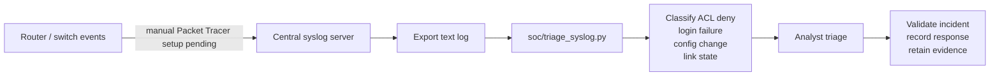

# Mini SOC / centralized monitoring workflow

## Honest scope

The current Packet Tracer evidence does **not** show a configured syslog server, ACL logging, IDS/IPS, or SIEM. The repository adds a deterministic offline parser for selected Cisco IOS syslog messages; the included fixture is synthetic and is not evidence captured from the `.pkt` file. This is a lab-scale mini SOC workflow, not a production SIEM.



## Offline triage

```bash
python soc/triage_syslog.py soc/fixtures/synthetic-ios-syslog.log
python soc/triage_syslog.py exported-router.log --json
```

The parser reports only recognized events and never labels unmatched text as malicious. Supported event families are ACL denies, failed logins, configuration changes, and link-state changes. Severity is a deterministic triage priority, not measured risk or detection accuracy.

## Packet Tracer integration — manually pending

1. Confirm the selected router/switch images support `logging host`, buffered logging, timestamps, and ACL `log` keywords.
2. Add a dedicated monitoring/syslog endpoint only if supported by the installed Packet Tracer version.
3. Configure device time consistently, then enable appropriately scoped logging without exposing lab credentials.
4. Add `log` only to selected deny entries to avoid excessive noise.
5. Generate a known denied flow, confirm the event at the logging endpoint, export it, and run the offline parser.
6. Capture screenshots showing the sender configuration, received event, timestamp, source/destination, and related ACL counter change.

Until those steps are completed, centralized collection remains a designed extension rather than verified Packet Tracer behavior.
